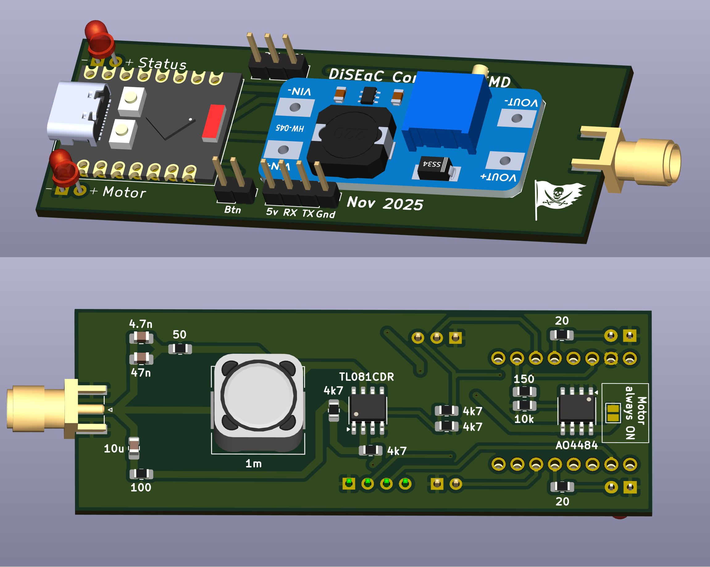
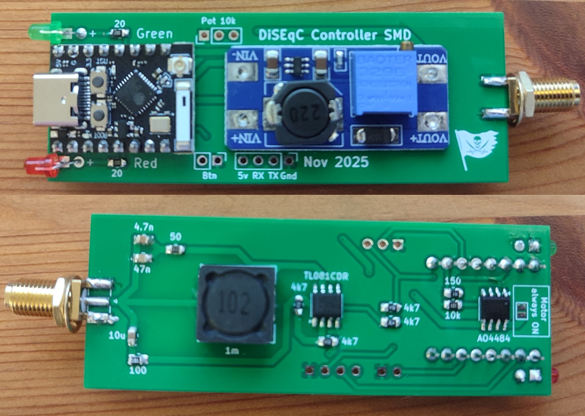
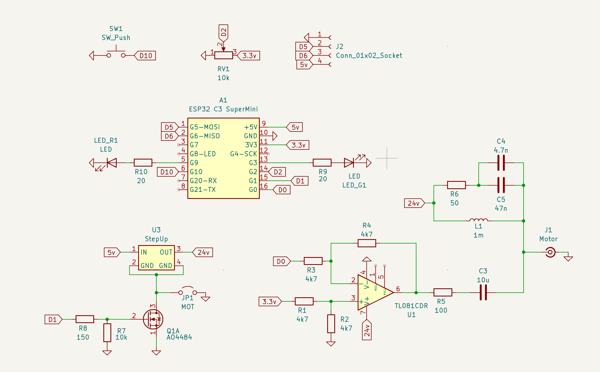
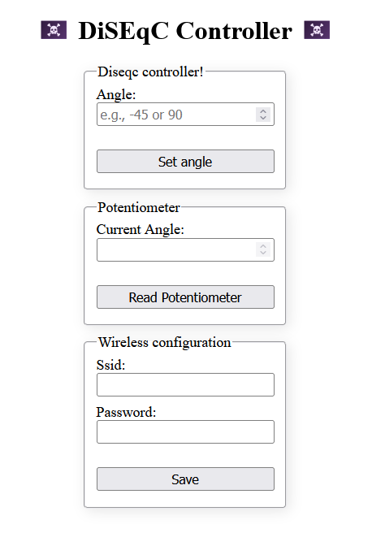
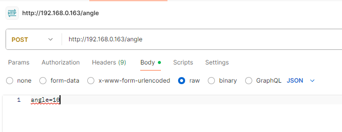
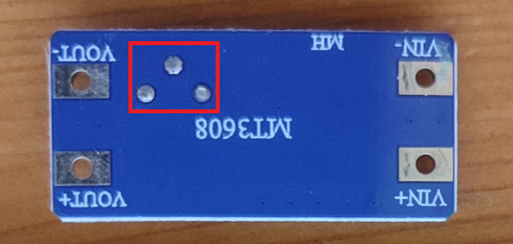
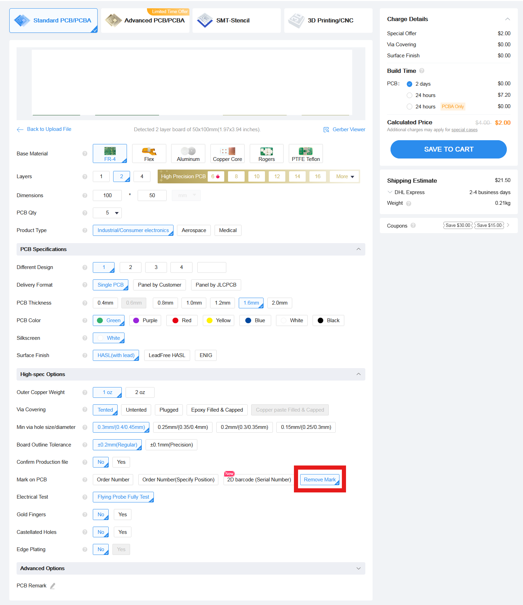

# DiseqC_Controller
Controller board based on a ESP32 to control DiseqC rotors

### This repo is a work in progress! Eveything is subject to change!

#### Please make sure to visit the [satcom radio website](https://satcomradio.github.io/)

----

### ESP32 image

First install nanoframework:  
In a powershell window write: `dotnet tool install -g nanoff`  
Check [this link](https://github.com/nanoframework/nanoFirmwareFlasher) for more information

If you want to build the code:  

Install nanoframework on the ESP32 C3 with the command:
`nanoff --update --target XIAO_ESP32C3 --serialport COM{YOUR NUMBER} --masserase`  

Then compile the code and upload  

If you only want to flash the Diseq controller to your ESP32:  

`nanoff --target XIAO_ESP32C3 --update --serialport COM{YOUR NUMBER} --deploy --image "c:\PATH_TO_YOUR\DiseqC.bin"`  

----

### General info

Before connecting the rotor, ADJUST THE VOLTAGE to around 18v max!  
To do so, send the command to move the rotor, monitor the voltage in the SMA output and adjust the trimmer.

When turning the controller on the status led will flash fast to indicate that it's trying to connect to your wifi.

When there's no wifi configured or it didn't managed to connect, the ESP32 will create it's own access point and the led will flash slowly.  
Connect to it and use the rotor controller at:
`http://192.168.5.1`

If the controller manages to connect to your wifi, the status led will be on continuously.  
Check it's IP address on your modem page.

You can also send an angle using a POST to the following API:

The potentiometer works in intervals of 20º. It's not linear due to limitations of the ESP32
You can check the current value on the website and mark it down with a pen in the metal case.

----

### Construction:

Make sure to trim the solder fillets at the bottom of the step up converter. 
It's the only difficult part to sodler as you need that it makes a good contact with the tabs at the bottom

Fold the leds before soldering them as shown in previous pictures.

----

### Ordering the PCB:

Download the Gerber file from this repo and order it a jlcpcb with the default options.  
The only option I've changed is to remove the manufacture code mark

----

### BOM:

- [80x32x32 mm case](https://aliexpress.com/item/1005005484479479.html)
- [ESP32 C3 super mini with antenna port](https://aliexpress.com/item/1005007785335513.html)
- [SMA Edge connector](https://aliexpress.com/item/1005007013777316.html)
- [UFL pigtail](https://aliexpress.com/item/1005009270045616.html)
- 2.54mm Header pins (usually included with the ESP32)
- 0805 capacitor 10u
- 0805 capacitor 4.7n
- 0805 capacitor 47n
- 0805 capacitor 10u
- 0805 resistor 4k7
- 0805 resistor 100
- 0805 resistor 50
- 0805 resistor 10k
- 0805 resistor 150
- 0805 resistor 20
- [12x12 1m CDRH125 inductor](https://aliexpress.com/item/1005002743197146.html)
- [3mm 3v led](https://aliexpress.com/item/1005006269054479.html)
- [AO4484](https://aliexpress.com/item/1005009121264682.html)
- [TL081CDR](https://aliexpress.com/item/1005007336116897.html)
- [MT-3608 Step up module](https://aliexpress.com/item/1005007723986240.html)
- [10k potentiometer with button](https://aliexpress.com/item/1005009506482081.html)
