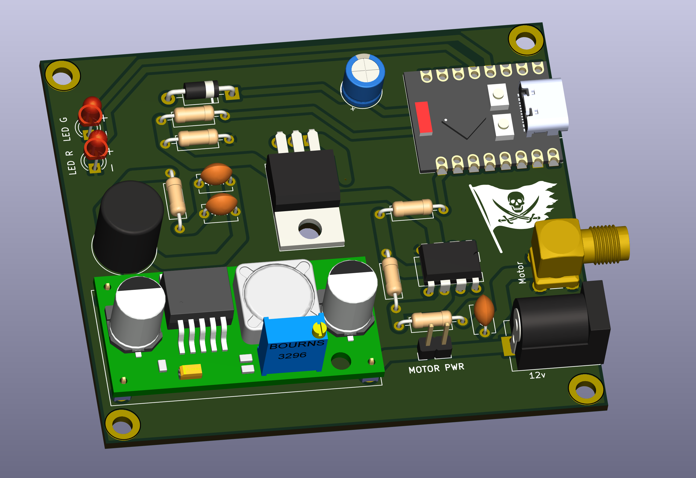

# DiseqC_Controller
Controller board based on a ESP32 to control DiseqC rotors

## This repo is a work in progress!

----

### ESP32 image

First install nanoframework:  
In a powershell window write: `dotnet tool install -g nanoff`
Check [this link](https://github.com/nanoframework/nanoFirmwareFlasher) for more information

If you want to build the code: 

Install nanoframework on the ESP32 C3 with the command:
`nanoff --update --target XIAO_ESP32C3 --serialport COM{YOUR NUMBER} --masserase`

Then compile the code and upload

If you only want to flash the Diseq controller to your ESP32:

`nanoff --target XIAO_ESP32C3 --update --serialport COM{YOUR NUMBER} --deploy --image "c:\PATH_TO_YOUR\DiseqC.bin"`

----

### General info

Before connecting the rotor, ADJUST THE VOLTAGE to around 18v max!

When there's no wifi configured, the ESP32 will create it's own access point. Connect to it and use the rotor controller at:
`http://192.168.5.1`

If you setup the ESP32 to connect to your wifi, check the IP address on your modem page.

